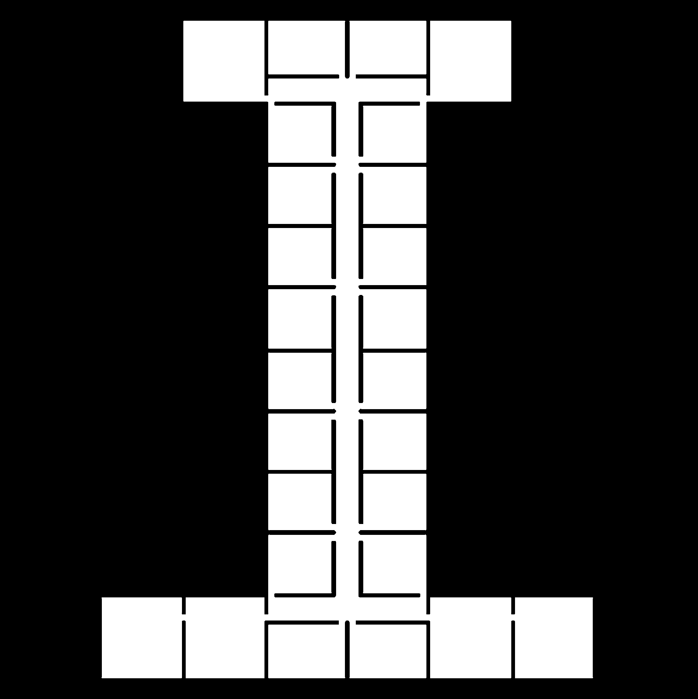
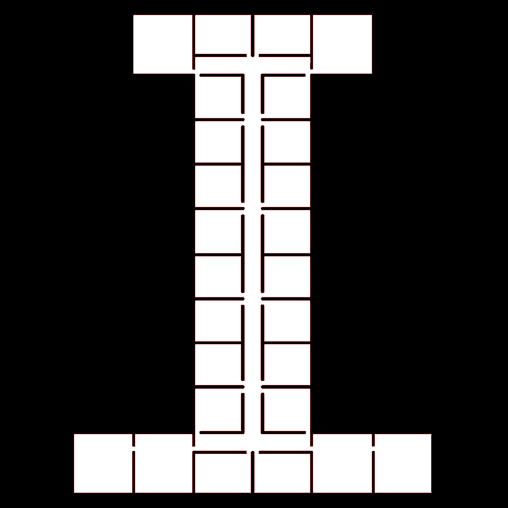
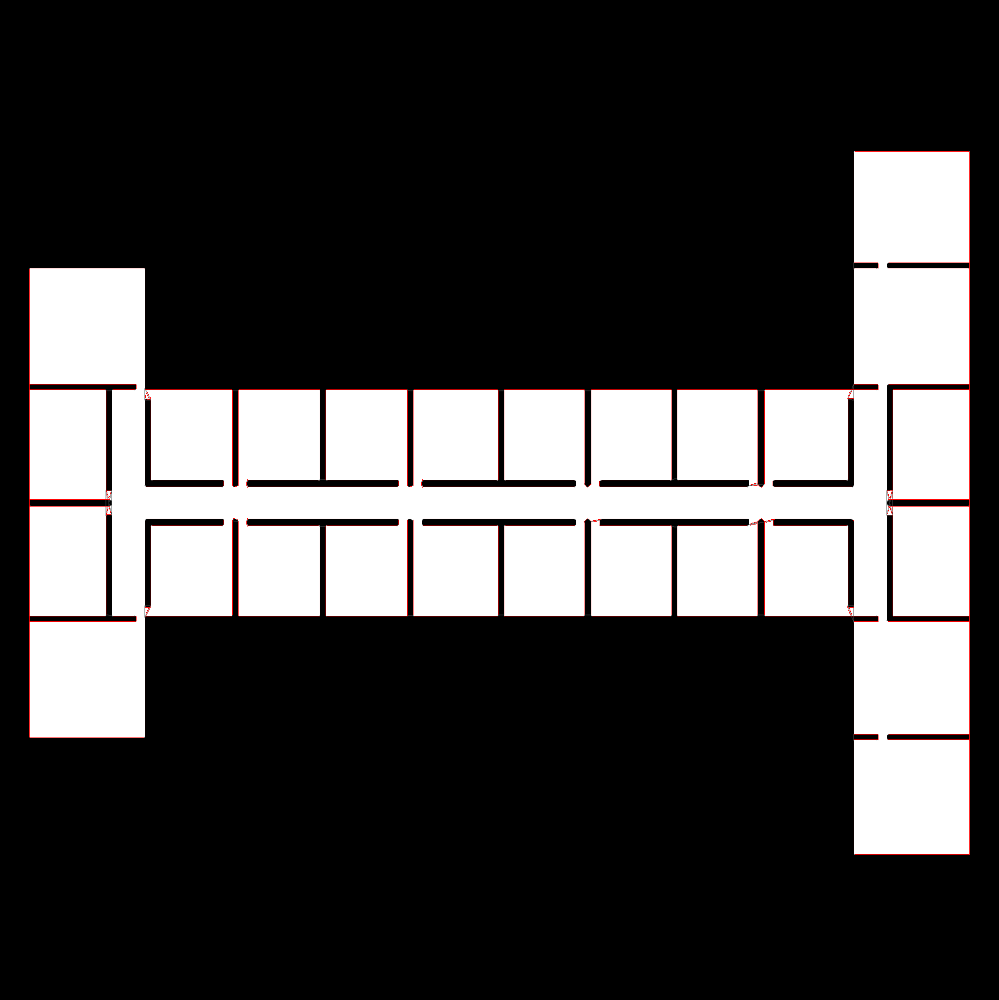
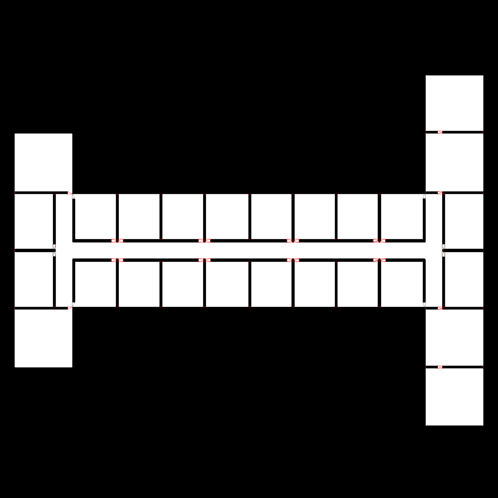
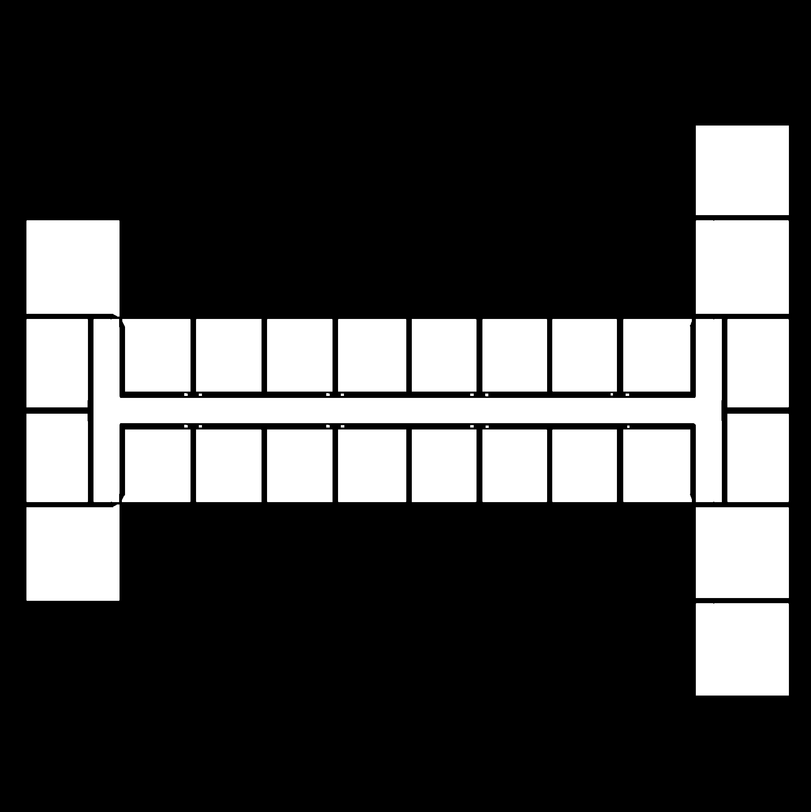
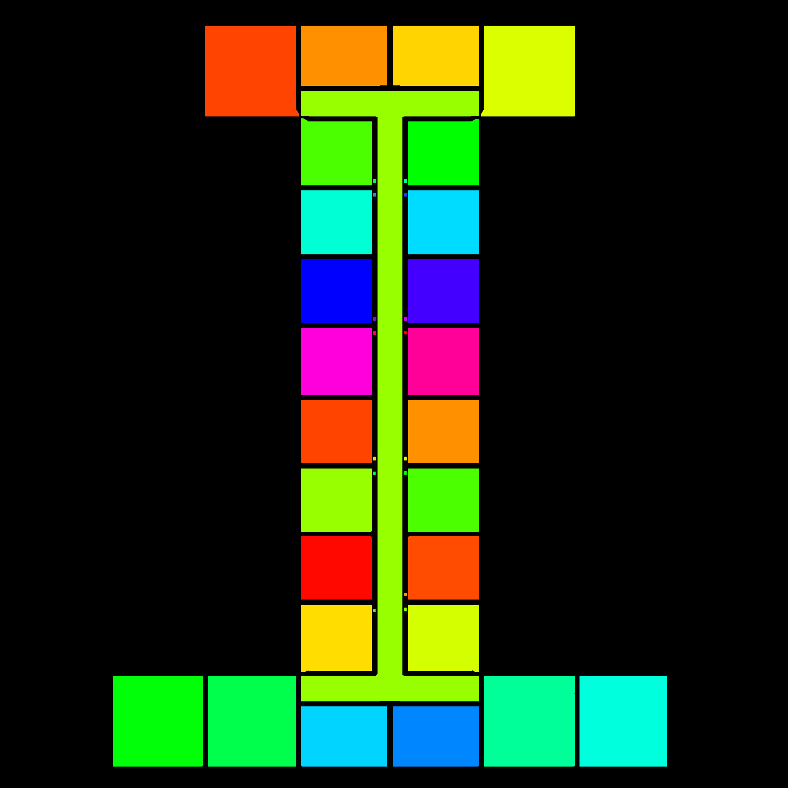

# Automatic Room Segmentation

> This repository is made for the Computer Vision course project - Jan 2019.

**Dependencies:**
- [OpenCV](https://pypi.org/project/opencv-python/)
- [NumPy](https://numpy.org/)

---

Detecting rooms of a floor plan.

- [Algorithm](#algorithm)
- [Comparision](#comparision)
- [Steps](#steps)
- [Related works](#related)

## algorithm

- Make it square
- Convert to black-and-white
- Line Segment Detection (LSD)
- Morphology (Erosion, Open)
- Connected Components

First, the input image is converted into a squared black-and-white image.
Then the lines of the squared image are detected using the LSD algorithm.
Every line shorter than a predefined value (`first_line_tresh`) is removed, and the lines with the same linear equation are connected with new lines.
The same step is repeated after the image is rotated for 90 degrees.
Next, to make the new lines larger, the morphology operations (erode and open) are applied to the image.
Finally, using the connected component algorithm with 4-way connectivity, the connected areas (rooms) are detected and filled with the same colour.

## comparision

## steps

- Input:  

- 0: SquareImage and black-and-white  

- 1: DetectedLines  

- 2: ExtendedLines  

- 3: DetectedLines  

- 4: ExtendedLines  

- 5: MorphologyErodeOpen  

- 6: Output  

## related
- [Automatic Room Segmentation from Unstructured 3D Data of Indoor Environments](https://people.csail.mit.edu/sclaici/publication/room-segmentation/)
- [Room Segmentation: Survey, Implementation, and Analysis](https://ieeexplore.ieee.org/document/7487234)
- [Coverage Path Planning and Room Segmentation in Indoor Environments using the Constriction Decomposition Method](https://uwspace.uwaterloo.ca/bitstream/handle/10012/12240/Brown_Stanley.pdf?sequence=3)
- [Automatic Room Segmentation of 3D Laser Data Using Morphological Processing](https://www.mdpi.com/2220-9964/6/7/206)
- [Human-Like Room Segmentation for Domestic Cleaning Robots](https://www.mdpi.com/2218-6581/6/4/35)
